# Hacking Guide

This guide provides a comprehensive overview of the core gameplay mechanic in DeepNet: **Hacking**.

## 1. Scanning Targets

The first step in any breach is to identify vulnerable targets on the network using the scan [command](../commands/index.md).

`deepscan *.*.*.*`
`scan *.*.*.*` (alias)
`nmap *.*.*.*` (alias)

```text
[SCAN] deepnet-scan *.*.*.* --rate 10kpps --mode syn,udp,icmp
[SCAN] noise profile: adaptive

SYN  -> 51.44.142.27  ...  RST
SYN  -> 146.14.223.142  ...  filtered
PING -> 112.175.134.31  ...  no route
ARP  -> 8.66.122.151  ...  no reply
SYN  -> 132.202.119.117  ...  RST  (fw block)
PING -> 179.35.3.214  ...  no route
SIG  -> 152.180.76.142  ...  weak handshake
SYN  -> 128.245.182.160  ...  ACK  [port 22]
ROUTE-> 155.152.188.52  ...  cached
[truncated ...]

Target          Status      Service Surface
-------------------------------------------------
62.82.61.209    up          513/tcp  open  rlogin
                              vectors: SSH [ICE 2 | Exp Wide | 22/tcp]
                              [BLOC: MERIDIAN]
                              [WORLD: CRISIS patch:+0 defense:7% loot:+16%]
103.110.159.81  up          513/tcp  open  rlogin
                              vectors: HTTP [ICE 2 | Exp Medium | 80/tcp]
                              [WORLD: CRISIS patch:+1 defense:15% loot:+12%]
85.97.24.197    up          513/tcp  open  rlogin
                              vectors: SMTP [ICE 2 | Exp Medium | 25/tcp] | HTTPS [ICE 3 | Exp Medium | 443/tcp]
                              [WORLD: CRISIS patch:+1 defense:15% loot:+12%]
62.247.80.245   up          513/tcp  open  rlogin
                              vectors: SMTP [ICE 2 | Exp Medium | 25/tcp] | HTTPS [ICE 3 | Exp Medium | 443/tcp]
                              [BLOC: MERIDIAN]
                              [WORLD: CRISIS patch:+0 defense:7% loot:+16%]
178.115.249.208 up          513/tcp  open  rlogin
                              vectors: SSH [ICE 2 | Exp Wide | 22/tcp]
                              [BLOC: MERIDIAN]
                              [WORLD: CRISIS patch:+0 defense:7% loot:+16%]

[INFO] 5 new target(s) mapped.
[SUCCESS] Scan complete. 5 hackable / 5 hosts visible.
[INFO] Type "targets" to see your scanned IP list.
```

---

## 2. Choosing a Target

Once the scan is complete, you can view and select your target from the mapped list:

`targets`

```
========================================
  SCANNED TARGETS
========================================

 1 | 62.82.61.209
 2 | 103.110.159.81
 3 | 85.97.24.197
 4 | 62.247.80.245
 5 | 178.115.249.208
Syntax: hack <ip|id>
Example: hack 1
Example: hack 178.62.4.199
[INFO] Select service and exploit in the overlay.
```

---


### Graphical Interface

If you prefer a visual approach, you can launch the hacking overlay:

`hack -gui`
`hack` (alias)
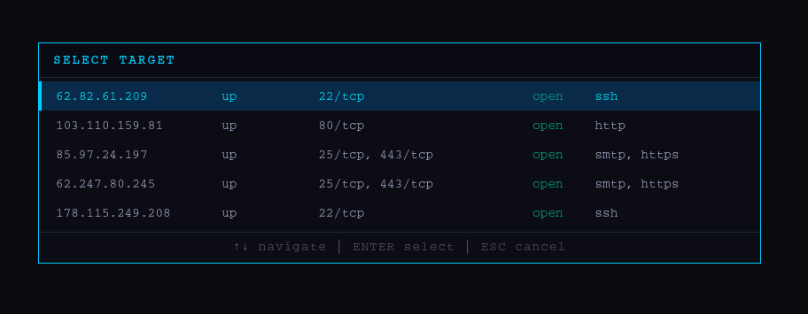

## 3. Briefing & Exploitation

After selecting a target, you will enter the **Pre-Breach Briefing**. Here you must analyze the target's defenses and choose the right tool for the job.

1. **Select Service:** Choose the service to target (e.g., `1`) or type `auto`.
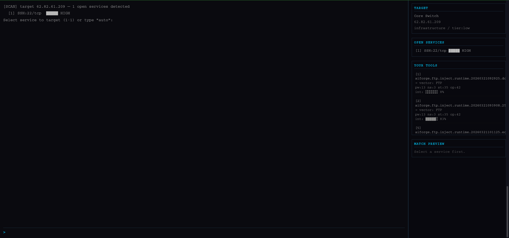

2. **Select Tool:** Pick the exploit that best matches the target's ICE level.
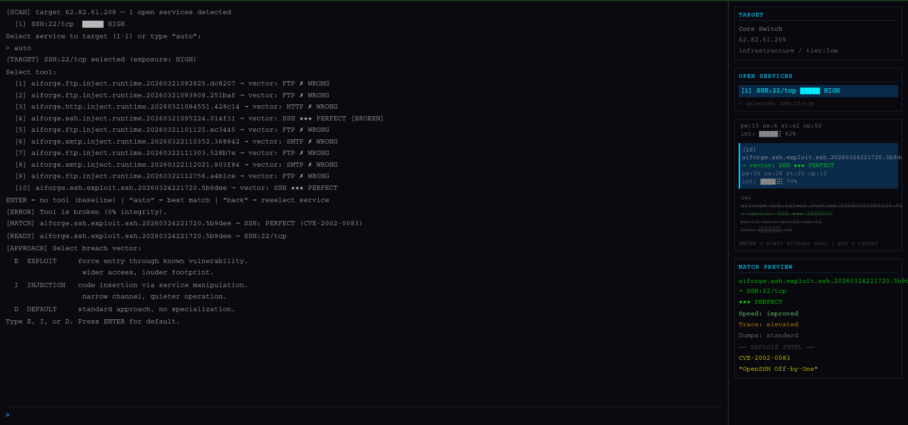

## 4. The Breach

this is the actual breach gameplay.

use `help` to display the available commands: 
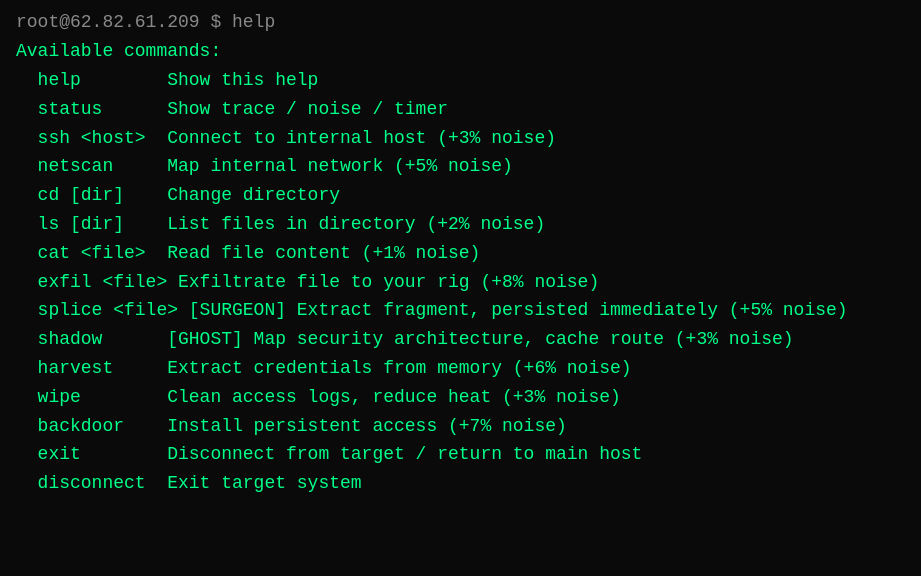

`ls` : list directories and files
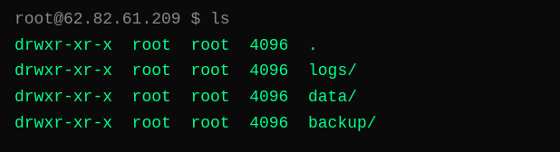

`cd` : Change directories.
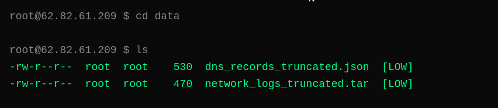

`exfil` : Exfiltrate data to your local rig.
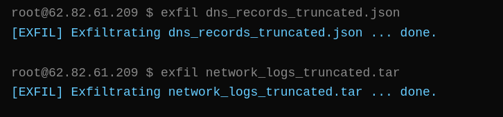
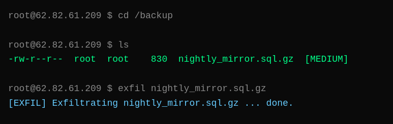

`netscan` : Map the internal network
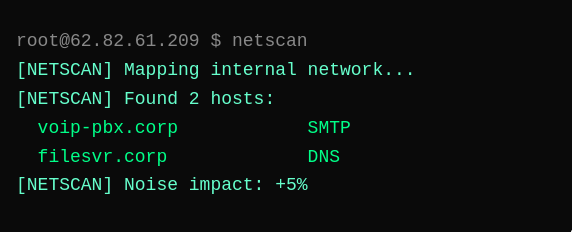

`harvest` : Extract credentials from memory.
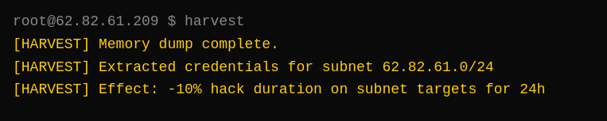

`backdoor` : Install persistent access (One-time use).
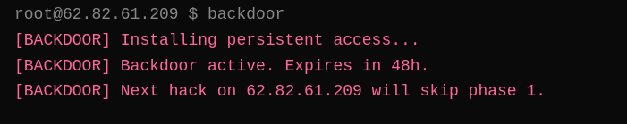

`wipe` : Clean access logs to reduce Heat gain
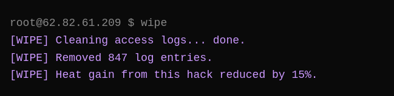

When you are done, use `disconnect` to terminate the session safely.
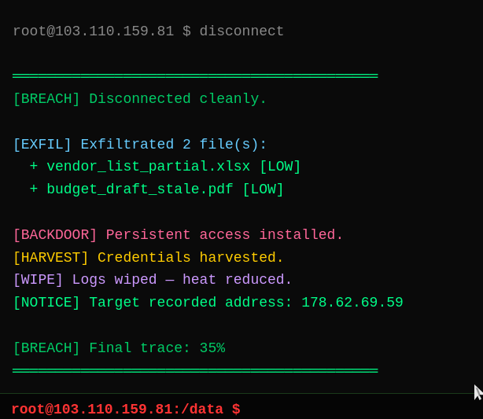
```
[BREACH] Clean extraction. 3 file(s) exfiltrated. Type "files" to view.
[CAPTURE] passive signal analysis recorded 163 network signatures. saved to ~/research/
```

---

!!! warning "PLEASE NOTE" 
Every action you perform increases the **TRACE** level. If the trace reaches **100%**, the system will initiate a hard lockout and alert local security. **Always disconnect before you are detected.**